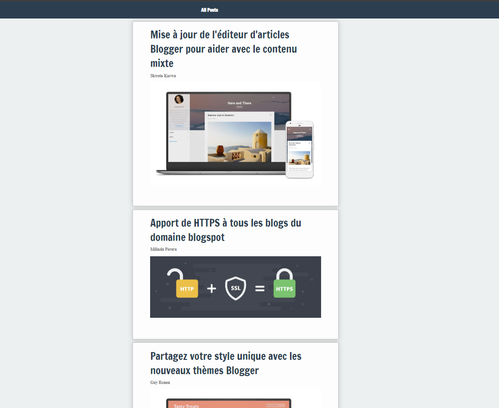
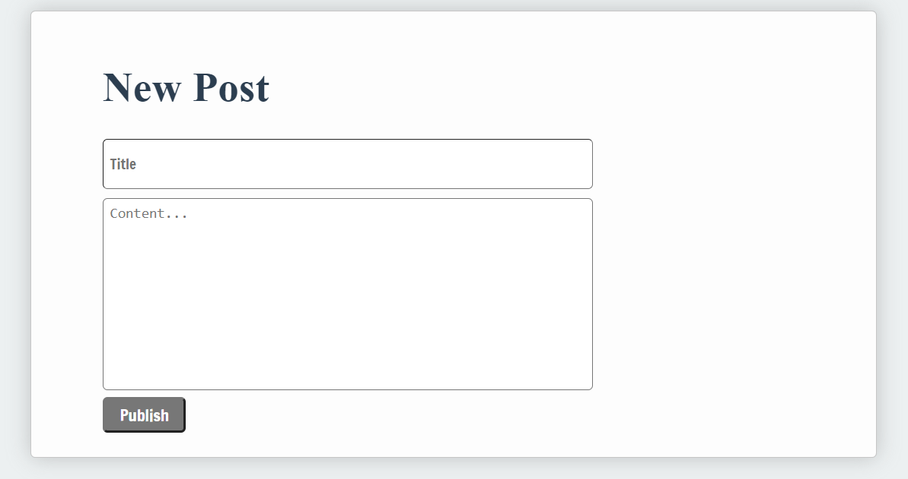
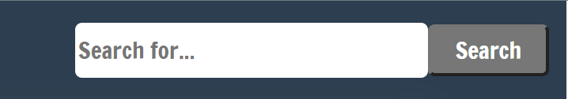

# blogging-app-react

## Objectif du Sprint
Notre objectif est de créer une application de blog dynamique sur une seule page.

### React

React est une bibliothèque JavaScript front-end gratuite et open-source pour construire des interfaces utilisateur basées sur des composants UI. Elle est maintenue par Meta (anciennement Facebook) et une communauté de développeurs individuels et d'entreprises.

React est un outil formidable pour créer des applications web bien structurées, car vous pouvez construire des composants encapsulés qui gèrent leur propre état, puis les composer pour créer des interfaces utilisateur complexes. Étant donné que la logique des composants est écrite en JavaScript plutôt qu'en templates, vous pouvez facilement faire circuler des données riches dans votre application et maintenir l'état en dehors du DOM.

React permet de créer des interfaces utilisateur interactives sans effort. Concevez des vues simples pour chaque état de votre application, et React mettra à jour et affichera efficacement les composants appropriés lorsque vos données changeront.

Les vues déclaratives rendent votre code plus prévisible et plus facile à déboguer.

### Beaucoup à apprendre sur React
 #### JSX et syntaxe ES6
JSX est une extension syntaxique de JavaScript. Utilisée avec React pour décrire à quoi l'interface utilisateur devrait ressembler. JSX peut vous rappeler un langage de template, mais il bénéficie de toute la puissance de JavaScript.

JSX produit des "éléments" React. Nous explorerons comment les afficher dans le DOM dans la prochaine section. Ici, vous pouvez trouver les bases de JSX nécessaires pour commencer.

ES6 est plein de surprises, consultez ces deux aide-mémoire impressionnants ici pour en apprendre davantage sur la déstructuration, les modules ES6 et autres fonctionnalités d'ES6.

#### Penser en React
Vous devrez commencer à penser en React

   ### Votre Projet 
Installez vos dépendances en utilisant npm install, vérifiez vos scripts dans package.json, puis exécutez votre application .

L'application contient les composants suivants :

 * [ 1 ] - Composant App
Le composant principal class component avec état qui affiche l'ensemble de l'application.

 * [ 2 ] - AllPosts (TousLesArticles)
Un composant function qui est censé parcourir une collection de données de blog reçues via des props et afficher une liste de son composant enfant PostDetails

 * [ 3 ] - OnePost (UnArticle)
OnePost est un composant function simple qui affiche un article

 * [ 4 ] - CreatePost (CréerUnArticle)
Un composant function qui devrait avoir des champs permettant à l'utilisateur de publier des blogs

 * [ 5 ] - Search (Recherche)
Un composant function qui contient des champs pour permettre à l'utilisateur de rechercher un blog

 ### Exigences de Base

* Vous avez du code de démarrage pour react router, refactorisez votre application et ajouter votre routes .

* Utilisez vos données factices src/data/exampleBlogData.js pour afficher votre AllPosts, continuez à utiliser les props pour afficher un composant PostDetails pour chaque objet d'article des données factices.

* Faites en sorte que votre application affiche OnePost lorsque l'utilisateur clique sur le titre du blog

* Vérifiez votre mécanisme de rendu conditionnel et mettez-le à jour pour qu'il puisse afficher un composant CreatePost lorsqu'un utilisateur clique sur le bouton de création d'article.

### Avancé

* Implémentez une fonctionnalité de Recherche en temps réel dans votre application de blog

